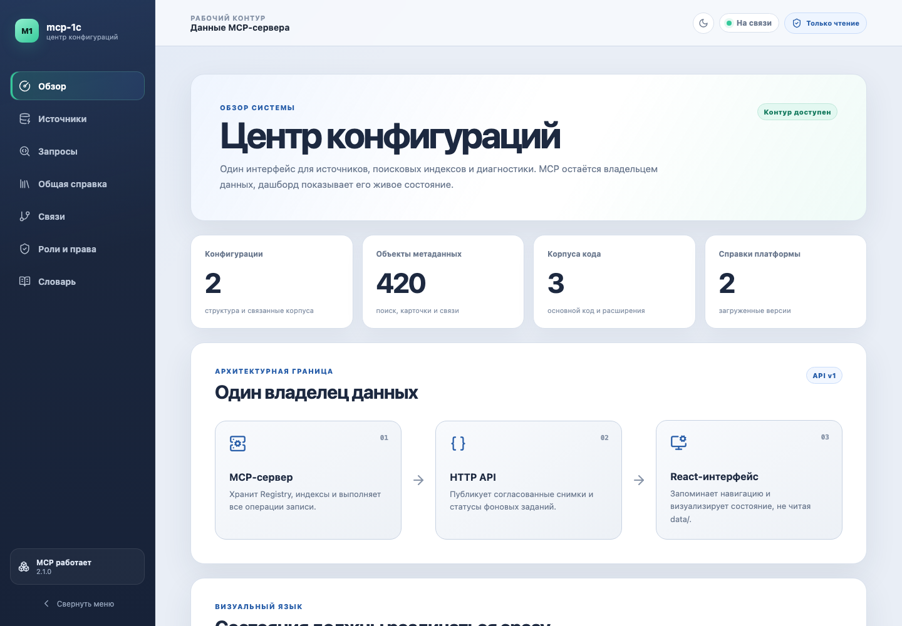

# MCP-сервер структуры конфигураций 1С

Локальный справочник для агентов, которые пишут BSL: метаданные конфигураций,
тексты модулей и форм, связи объектов и версионная справка платформы 1С.
Сервер работает одним Python-процессом без внешнего сервиса базы данных;
необязательная общая справка подключается готовым подписанным read-only
артефактом с SQLite.

Репозиторий не содержит справку фирмы «1С», выгрузки конфигураций и их
производные индексы. Всё состояние конкретной установки находится в отдельном
каталоге `data/` и не попадает в git.

<picture>
  <source media="(prefers-color-scheme: dark)" srcset=".github/assets/dashboard-overview-dark.png">
  <source media="(prefers-color-scheme: light)" srcset=".github/assets/dashboard-overview-light.png">
  
</picture>

<p align="center"><sub>Интерфейс дашборда на полностью синтетических данных.</sub></p>

## Состояние — 2026-09-05

| Контур | Состояние |
|---|---|
| Транспорт | Streamable HTTP `/mcp` и локальный `stdio`; SSE удалён |
| Метаданные | schema v1 XML/JSON, граф, карточки, виртуальные таблицы |
| Код и расширения | процедуры, тела, формы, места вызовов, происхождение объектов и полей; отдельный сеансовый снимок активности |
| Синтаксис | объединённые справки нескольких версий платформы |
| Общая справка | опциональный подписанный `.mcp1cref`; без доверенного артефакта две дополнительные ручки не регистрируются |
| Роли | объявленные права из native generation; без готового слоя две role-ручки отсутствуют |
| Дашборд | современная SPA включена по умолчанию; светлая и тёмная темы; `on` либо `off` |
| Авторизация Docker | два разных обязательных токена: `API_TOKEN` на чтение, `ADMIN_TOKEN` на запись |
| Тесты | `.venv/bin/python -m pytest`, 2004 |

Воспроизводимый прогон:

```bash
.venv/bin/pip install --require-hashes -r requirements-dev-lock.txt
.venv/bin/python -m pytest          # 2004 теста (прогон 2026-09-05)
```

## Навигация

| Раздел | Где читать |
|---|---|
| Полный Docker/Linux runbook | [ниже в этом README](#запуск-в-docker) |
| Современный дашборд | [dashboard/README.md](dashboard/README.md) |
| Загрузка конфигураций и расширений | [docs/configuration-loading.md](docs/configuration-loading.md) |
| Конфигурации MCP-клиентов | [docs/clients.md](docs/clients.md) |
| Все инструменты и порядок вызовов | [docs/tools.md](docs/tools.md) |
| Источники, CLI, bench и ручной сервер | [docs/operations.md](docs/operations.md) |
| Архитектура, кэш и проверки | [docs/architecture.md](docs/architecture.md) |
| Обработка выгрузки для 1С | [exporter-1c/README.md](exporter-1c/README.md) |

## Помочь проекту реальным примером

Если при работе над реальной задачей MCP вернул неверный, неполный или
бесполезный ответ, заведите
[issue](https://github.com/AzeevAN/mcp-1c/issues/new).

Особенно полезны случаи, когда ответ выглядел правдоподобно, но привёл к
неверному коду, либо нужные сведения пришлось искать вручную.

Укажите:

- какую задачу вы решали;
- как сформулировали запрос;
- какой MCP-инструмент вызвали;
- что получили;
- что ожидали получить;
- версию платформы и версию MCP-сервера;
- к какой практической ошибке или дополнительной работе привёл ответ.

Перед публикацией обезличьте пример. Не прикладывайте выгрузки конфигураций,
исходный код, рабочие имена, токены и содержимое каталога `data/`.

---

# Запуск в Docker

Ниже описан полный путь от чистого Linux-сервера до работающего контейнера.
Критичные шаги не вынесены во внешнюю документацию: права, обязательные токены,
режим дашборда, healthcheck и удалённый HTTPS настраиваются по этому разделу.

## Что запускается

Единственный пользовательский [compose.yaml](compose.yaml):

- получает готовый образ `ghcr.io/azeevan/mcp-1c:2.1.0` без локальной сборки;
- запускает процесс как UID/GID `10001:10001`;
- монтирует подготовленный каталог хоста в `/data`;
- публикует порт только на `127.0.0.1`;
- включает `no-new-privileges` и удаляет все Linux capabilities;
- ограничивает Docker JSON-логи тремя файлами по 10 МиБ;
- требует два разных безопасных токена до старта;
- запускает современный дашборд по умолчанию.

Один образ работает с `MCP1C_DASHBOARD=on|off`; серверный HTML удалён. Для внешнего
доступа за уже настроенным HTTPS reverse proxy используется
`MCP1C_ACCESS=https-proxy`; отдельного Compose-файла и встроенного proxy нет.

Есть два поддержанных способа получить этот образ:

1. Обычный пользователь скачивает готовый
   `ghcr.io/azeevan/mcp-1c:2.1.0` и запускает один `compose.yaml` по инструкции
   ниже.
2. Разработчик собирает локальный тег из чистого checkout командой
   `python3 tools/build_image.py mcp1c:local`, указывает
   `MCP1C_IMAGE=mcp1c:local` и использует тот же `compose.yaml`.

Второй путь архивирует только отслеживаемые файлы текущего `Git HEAD` и
отказывает при незакоммиченных или новых неотслеживаемых файлах. Рабочий
`data/`, `.env`, секреты, локальные исследования, агентские настройки и любые
другие ignored-файлы физически не передаются Docker daemon. Дополнительный
deny-by-default `.dockerignore` разрешает только runtime Python, lock-файл и
исходники SPA. Node и npm на хосте не нужны: frontend собирается внутри
изолированного build stage.

## Требования

- 64-битный Linux или Docker Desktop;
- Docker Engine с Compose v2 (`docker compose`, не старый `docker-compose`);
- `curl` для получения Compose и проверки;
- свободный локальный порт `5001` либо другое значение `MCP1C_PORT`;
- место под исходники и индексы в отдельном каталоге.

Проверка:

```bash
docker version
docker compose version
curl --version
```

На Linux пользователь развёртывания должен иметь доступ к Docker. Добавление в
группу `docker` фактически даёт административные права на машину; принимайте
это решение осознанно или запускайте команды Docker через `sudo`.

## 1. Получить Compose

```bash
mkdir mcp-1c
cd mcp-1c
curl --fail --show-error --location --output compose.yaml \
  https://raw.githubusercontent.com/AzeevAN/mcp-1c/v2.1.0/compose.yaml
curl --fail --show-error --location --output .env.example \
  https://raw.githubusercontent.com/AzeevAN/mcp-1c/v2.1.0/.env.example
```

Исходники и Node для обычного запуска не нужны. Точный release-тег в URL и
`MCP1C_IMAGE` не дают незаметно перейти на другую версию.

Образ из GHCR должен быть публичным: тогда первый `docker compose up -d`
скачивает его без `docker login`. Release workflow после публикации проверяет
именно анонимный pull точного digest.

## 2. Подготовить окружение

```bash
cp .env.example .env
```

Основные значения `.env`:

```dotenv
MCP1C_DATA_DIR=/srv/mcp1c/data
MCP1C_PORT=5001
MCP1C_IMAGE=ghcr.io/azeevan/mcp-1c:2.1.0
MCP1C_DASHBOARD=on
MCP1C_ACCESS=local
API_TOKEN=<первый случайный токен>
ADMIN_TOKEN=<второй случайный токен>
```

Официальный образ не запускается без обоих токенов даже на localhost. Значения
должны различаться, содержать не менее 32 печатных ASCII-символов без пробелов
и не быть примерами из документации.

Сгенерируйте два значения и вручную перенесите их в `.env`:

```bash
python3 -c "import secrets; print(secrets.token_urlsafe(32))"
python3 -c "import secrets; print(secrets.token_urlsafe(32))"
```

`.env` находится в `.gitignore`. Не добавляйте реальные токены в Compose,
README, shell history или конфиги, которые публикуются вместе с проектом.
Ограничьте чтение файла:

```bash
chmod 0600 .env
```

Переменные:

| Переменная | Назначение | По умолчанию |
|---|---|---|
| `MCP1C_DATA_DIR` | bind source на машине Docker | `./data` |
| `MCP1C_PORT` | loopback-порт хоста | `5001` |
| `MCP1C_IMAGE` | готовый OCI-образ или точный digest | `ghcr.io/azeevan/mcp-1c:2.1.0` |
| `API_TOKEN` | чтение MCP и дашборда | обязателен |
| `ADMIN_TOKEN` | загрузка, удаление, incoming, словарь, reload | обязателен и отличается от `API_TOKEN` |
| `MCP1C_DASHBOARD` | `on` — SPA, `off` — без UI | `on` |
| `MCP1C_ACCESS` | `local` либо `https-proxy` | `local` |
| `MCP1C_REFERENCE_ARTIFACT` | `off`, пусто либо путь к `.mcp1cref` внутри контейнера | пусто: управляемый `data/reference/reference.mcp1cref` |
| `MCP1C_CONFIG_SOURCE` | заранее смонтированный read-only ZIP, каталог ZIP или корень файловой выгрузки | выключено |
| `MCP1C_ALLOW_SELF_RESTART` | разрешить admin-дашборду завершить процесс для возврата внешним supervisor | Compose: `1`; bare-запуск: выключено |

Прежнее значение `spa` переименовано в `on`. У удалённого серверного
HTML-режима прямой замены нет: выберите `on` для SPA либо `off` без UI.
`https-proxy` не открывает порт наружу и не запускает TLS — он только разрешает
серверу доверять заголовкам от внешнего proxy на той же машине.

Обхода подписи в публикуемом runtime нет: неподписанная SQLite всегда получает
`untrusted` и не открывается сервером.

## 3. Подготовить каталог данных на Linux

Это обязательный шаг. Compose использует bind mount и намеренно содержит
`create_host_path: false`: отсутствующий каталог останавливает запуск вместо
того, чтобы Docker молча создал root-owned `data/`.

Контейнер работает как `10001:10001`. Для обычного rootful Docker на Linux:

```bash
sudo install -d -o 10001 -g 10001 -m 0750 /srv/mcp1c/data
sudo install -d -o 10001 -g 10001 -m 0750 /srv/mcp1c/data/bootstrap
sudo install -d -o 10001 -g 10001 -m 0750 /srv/mcp1c/data/incoming
```

Проверка владельца и режима:

```bash
stat -c '%u:%g %a %n' \
  /srv/mcp1c/data \
  /srv/mcp1c/data/bootstrap \
  /srv/mcp1c/data/incoming
```

Ожидается `10001:10001 750` для всех трёх строк.

Почему недостаточно `mkdir -p data/bootstrap`: каталог получит UID
пользователя развёртывания или `root`, а процесс UID `10001` сможет читать его,
но не создавать `registry.json`, `sources/`, `index/` и журналы. `chown`,
выполненный при сборке образа, не помогает: bind mount перекрывает
подготовленный внутри образа `/data`.

Не исправляйте это командами `chmod -R 777` и не запускайте контейнер от root.
Данные конфигураций должны оставаться закрытыми, а non-root процесс — частью
защиты.

### Локальный каталог внутри проекта

На чистом Linux вместо `/srv` можно использовать `./data`:

```bash
mkdir -p data
sudo chown -R 10001:10001 data
sudo chmod 0750 data
```

Тогда оставьте `MCP1C_DATA_DIR=./data`.

### Docker Desktop

На macOS и Windows Docker Desktop использует файловое посредничество своей
Linux VM, поэтому числовой владелец на хосте может отличаться от
`10001:10001`. Создайте каталог явно, но не меняйте владельца без причины:

```bash
mkdir -p data/bootstrap data/incoming
```

Фактическую запись всё равно проверит контейнер перед стартом.

### Rootless Docker и user namespace remap

При remap числовой UID хоста может отличаться от UID внутри контейнера. Не
применяйте `chown 10001:10001` вслепую. Для собственного образа сначала
соберите локальный тег из чистого Git HEAD, затем проверьте отображение
коротким запуском с тем же bind mount:

```bash
python3 tools/build_image.py mcp1c:local
docker run --rm \
  --entrypoint sh \
  --mount type=bind,src=/srv/mcp1c/data,dst=/data \
  mcp1c:local \
  -c 'id; test -w /data'
```

Если `test` возвращает ненулевой код, назначьте host UID/GID согласно
настройке `subuid`/`subgid` вашего Docker daemon либо используйте обычный
rootful контур. Сам сервер в сообщении печатает фактические UID/GID процесса.

### SELinux

Bind mount помечен `selinux: Z`: на SELinux-хосте Compose выдаёт каталогу
приватную метку контейнера, на остальных системах параметр не влияет. Если
политика организации запрещает автоматическое relabel, согласуйте постоянный
контекст каталога с администратором вместо отключения SELinux.

## 4. Положить начальные источники

### Не перепутайте два разных ZIP из 1С

Слова «выгрузка конфигурации» относятся здесь к двум разным операциям. Архивы
не взаимозаменяемы и загружаются разными путями:

| Что за файл | Как получить | Что внутри | Куда передать |
|---|---|---|---|
| `СтруктураКонфигурации_*.zip` | внешняя обработка проекта `ВыгрузкаСтруктурыКонфигурации` | `manifest.xml` или `manifest.json`, затем `objects/*.xml` или `objects/*.json` | форма загрузки дашборда; также `bootstrap/` или `mcp1c.cli reg-add` |
| `СнимокРасширений_*.json` | отдельная обработка из `exporter-1c/`, запущенная в нужном сеансе | зарегистрированные, действующие и не применённые расширения | форма загрузки дашборда или `mcp1c.cli reg-add`; сначала нужна структура конфигурации |
| ZIP выгрузки конфигурации или расширения в файлы | **Конфигуратор → Конфигурация → Выгрузить конфигурацию в файлы… → Архив** | `Configuration.xml`, структура, модули, формы и роли | блок «Полная файловая выгрузка» страницы «Источники»; также двухфазный intake API из browser-upload, `data/incoming/` или `MCP1C_CONFIG_SOURCE` |
| `shcntx_ru.hbk` | каталог установленной платформы 1С | методы, свойства, события и объекты платформы | форма загрузки дашборда; также `bootstrap/` или `mcp1c.cli reg-add` |

Прежняя команда `POST /api/v1/sources/incoming/parse` сохранена только для
совместимости code-only клиентов и больше не показывается в SPA. Она не создаёт
конфигурацию в Registry: сначала ей по-прежнему нужна отдельно загруженная
`СтруктураКонфигурации_*.zip`. Для новых загрузок используйте единый двухфазный
путь ниже: он создаёт конфигурацию или обновляет согласованные слои из одного
кандидата.

### Двухфазный intake API

В B-only фактическая версия работающей платформы **неизвестна**:
`CompatibilityMode` из `Configuration.xml` хранится отдельно как
`compatibility_mode`, а не как `platform`. MCP явно предупреждает, что
фильтрация синтаксиса по runtime-версии выключена и доступность метода в базе
не подтверждена. Справка не объявляется совпадающей или ненужной только на
основании режима совместимости. Текущий разбор B также не получает имена
предопределённых элементов: пустой список не доказывает их отсутствие в базе.
Это не блокирует загрузку структуры, кода, форм и ролей B.

`GET /api/v1/sources` передаёт в строке конфигурации `platform` (пусто, если
неизвестна), `compatibility_mode`, `predefined_available`, `syntax_relation`
(включая `unknown`) и русские оговорки в `notes`. Source A предоставляет
runtime-факты для своей базовой структуры. При полной замене base новой B
старые факты A не переносятся автоматически. Старые B-поколения читаются с
исправленной интерпретацией без перезаписи payload/manifest; новый разбор имеет
`parser_version=4`. Само обновление кода не запускает переразбор источников.

Новый API принимает ту же полную файловую выгрузку как самостоятельного
кандидата. Обнаружение и preview ничего не публикуют: активный Registry
меняется только после отдельного `confirm`. Все маршруты административные и
требуют `ADMIN_TOKEN`:

| Метод и путь | Назначение |
|---|---|
| `GET /api/v1/sources/intake` | по запросу проверить managed browser staging, `data/incoming/` и настроенный read-only источник; вернуть все кандидаты, группы, локальные ошибки и durable jobs |
| `POST /api/v1/sources/intake/upload` | принять один ZIP до 500 МиБ в managed staging и выполнить probe без тяжёлого разбора |
| `POST /api/v1/sources/intake/start` | начать `create`, `update` или `update_full`; построить semantic preview без публикации |
| `GET /api/v1/sources/intake/jobs/{job_id}` | получить durable progress, послойный diff, no-op или ошибку после рестарта |
| `POST /api/v1/sources/intake/confirm` | атомарно опубликовать готовый preview; повтор того же confirm идемпотентен |
| `POST /api/v1/sources/intake/discard` | отменить неопубликованный preview и удалить его рабочие данные; входной `incoming`-архив не меняется |

Предел 500 МиБ относится только к передаче ZIP через browser-upload.
Архивы, уже находящиеся в `data/incoming/`, не имеют фиксированных лимитов
сырого файла, отдельного элемента, коэффициента сжатия и суммарного
распакованного объёма: это доверенный server-side путь для больших выгрузок
без HTTP-копии. Для них сервер по-прежнему проверяет безопасные и однозначные
пути, symlink, специальные файлы, шифрование, число записей, CRC и неизменность
архива. Browser-upload сохраняет все ресурсные бюджеты. У настроенного
read-only источника сырой файл также не проходит через HTTP-лимит, но открытые
parser-ом элементы остаются в общем ресурсном бюджете.

В SPA тот же контракт представлен отдельным блоком «Полная файловая выгрузка»
на странице «Источники». Интерфейс не выбирает вариант автоматически: человек
явно запускает «Создать конфигурацию», «Обновить код, формы и роли» либо
«Обновить полностью», видит progress и послойный semantic preview и только
после этого отдельно публикует изменения. Готовый preview сразу появляется в
списке без ручного обновления страницы; его кнопка называет конфигурацию и
исходный ZIP, а не только внутренний `candidate_id`. Preview сохраняется на
сервере автоматически: крестик только закрывает диалог, а «Отменить и удалить
preview» явно снимает job и её рабочие данные. После успешной отмены SPA не
запрашивает уже удалённую job. Параллельный снимок списка возвращает
согласованное состояние до либо после отмены, а не временный конфликт из-за
исчезнувшей между чтениями job. До отправки `confirm` ничего не публикует.
После отправки серверная атомарная публикация уже
запущена: диалог блокирует закрытие и повторный intake до ответа, а обновление
или закрытие страницы не является командой rollback. После успешного commit
тяжёлые collection/materialized-копии удаляются, для идемпотентного повтора
остаётся только компактный durable result; managed browser-upload также
снимается, а `incoming` и read-only источник не меняются.

Для существующей `legacy`-конфигурации первое обновление source B обязательно
полное: только `update_full` создаёт независимые payload всех пяти слоёв и
native generation manifest. До этого момента SPA не предлагает «Обновить код,
формы и роли», а прямой `update` отклоняется до запуска разбора понятным
конфликтом. После первой полной публикации становятся доступны оба варианта.
Готовый частичный legacy-preview, созданный прежней версией сервера, также
отклоняется контролируемой ошибкой и не приводит к HTTP 500 или частичной
публикации. Он показывается как локально устаревшая failed-job и не блокирует
список кандидатов или остальные операции intake.

При публикации готового слоя ролей сервер строит из сохранённого generation-
snapshot расходный файловый SQLite-индекс. Исходный ZIP после commit для этого
не нужен, полный корпус прав не удерживается коллекциями Python в памяти.
Индекс хранит объявленные права, полные пути дочерних объектов, явные запреты,
RLS и шаблоны. Одно `restrictionByCondition` остаётся одним ограничением, а
все его `field` возвращаются упорядоченным массивом `fields`; пустой
`condition` сохраняется как условное право, а не исчезает — в том числе у
шаблона ограничения. Пустой языковой код синонима роли также сохраняется,
если сам текст синонима присутствует. Повреждение или
несовпадение штампа приводит к пересборке из snapshot. Это сведения о составе
ролей конфигурации, а не об эффективном доступе пользователей информационной
базы. Пользователи, группы и назначения ролей сервер не загружает.

Descriptor без соседнего `Rights.xml` означает пустую роль, а не ошибку:
descriptor остаётся доступен, список прав пуст, три default-флага имеют
значение `null` и показываются как «не задано». Сервер не подменяет неизвестное
значение `false`. `Rights.xml` без descriptor по-прежнему даёт локальную ошибку
ролевого слоя и не блокирует структуру, код или формы.

Для плоской файловой раскладки descriptor-ом считается только точный файл
`Kind.Name.xml`; `Help`, `Predefined`, формы и макеты не выдаются за descriptor.
Обязательный `ExchangePlan.Name.Content.xml` приводится к тому же каноническому
пути, что и tree-вариант, а `Role.Name.xml`/`Role.Name.Rights.xml` — к единому
role snapshot. Скомпилированный `CommonModule.Name.Module` остаётся
скомпилированным member и не декодируется как текстовый BSL.
Расходный индекс такого member и индекс кода native-расширения поднимаются из
warm-кэша; отсутствие или повреждение кэша приводит к безопасной пересборке из
активного generation snapshot.
Параллельные cold-пересборки используют отдельный Snowball stemmer на
поток: сам stemmer изменяет внутреннее состояние, а общий экземпляр
вызывал редкий `IndexError`. На двух read-only CoW-копиях 2026-09-02
thread-local и сериализация lock вернули один digest. Их p50/p95:
66,860/67,096 и 66,547/68,393 с; steady RSS — 327,4/335,1 и
295,7/299,0 МиБ. Воспроизводимая команда:

```bash
.venv/bin/python tools/lab/measure_stemmer_concurrency.py \
  --modules-root /tmp/corpus-a --modules-root /tmp/corpus-b --repeat 3
```

Если фоновая сборка всё же падает, `Source.error` хранит raw-причину,
server log получает traceback, а административная страница «Источники»
показывает bounded техническую причину без имени исходного ZIP.
Обычный read-only ответ сохраняет обезличенную ошибку. Старый coverage-
журнал при `status=error` не выдаётся за актуальный.
После native source-B публикации тот же JSON-журнал создаётся для каждого
корпуса кода; если расходный файл отсутствует или устарел, restart восстанавливает
его из активного generation snapshot без повторной загрузки исходного ZIP.

`start` принимает только `candidate_id`, `action`, необязательные `job_id` для
возобновления и `parent_configuration`. Произвольного файлового пути в HTTP-
контракте нет. Для основной конфигурации доступны `create`, если такой
внутренней identity ещё нет; для существующей legacy-цели доступно только
первое `update_full`, а для native generation — `update` и `update_full`.
Для нового расширения доступно только `update_full`, для существующего — также
`update`; оба действия требуют явно выбранного и уже загруженного
`parent_configuration`. Имя и родителя сервер сверяет до тяжёлого разбора.

Browser-upload отправляется multipart-полем `file`. Ответ содержит candidate,
но ещё не job:

```bash
curl -fsS -H "X-Api-Token: $ADMIN_TOKEN" \
  -F 'file=@configuration.zip;type=application/zip' \
  http://127.0.0.1:5001/api/v1/sources/intake/upload

curl -fsS -H "X-Api-Token: $ADMIN_TOKEN" \
  -H 'Content-Type: application/json' \
  -d '{"candidate_id":"candidate-...","action":"create"}' \
  http://127.0.0.1:5001/api/v1/sources/intake/start
```

`MCP1C_CONFIG_SOURCE` — путь, видимый самому серверу. В Docker соответствующий
host-файл или каталог нужно отдельно bind-mount подключить в контейнер с
режимом `ro`; переданный через HTTP host-путь сервер не принимает. Проверка
`incoming` и read-only mount выполняется только по `GET .../intake`, без
фонового polling. В одном экземпляре сервера одновременно строится не больше
одного тяжёлого preview, чтобы пара загрузок не удвоила peak RSS.

`SettingsStorages` в текущий приём source B намеренно не входят целиком:
дескрипторы, `Form.xml`, модуль менеджера и модули форм отбрасываются до
coverage и не создают ошибку или статус частичного разбора. Прежний частичный
приём одного BSL без структуры удалён. Поэтому источники, разобранные до
`selection_version=6`, требуют явного повторного разбора, но сервер не изменяет
рабочие данные автоматически.

Source A и Source B представляют одну конфигурацию, а не две независимые базы.
Если загружена только A, доступны её runtime-структура и точные сведения о
платформе. Если загружена только B, сервер строит файловую базовую проекцию и
добавляет расширенную структуру, код, формы и роли. После загрузки обоих
источников A целиком определяет `base_structure`, а B сохраняет
`extended_structure`, код, формы и роли. Поиск, карточки, граф и MCP работают с
одним resolved-каталогом: общие реквизиты, параметры сеанса, журналы
документов, планы обмена, подписки, задания, общие формы и поддержанные боты не
требуют отдельного режима запроса. Несовместимый overlay в смешанном A/B view
отклоняется до смены active generation. Повторная Source A с тем же
семантическим SHA `base_structure` является no-op: generation pointer и
остальные слои не меняются.

Если во время построения индексов Source A другая операция обновила или
удалила ту же конфигурацию, загрузка A завершается ошибкой с предложением
повторить её. Уже опубликованное состояние не заменяется устаревшим:
повторная загрузка заново проверит актуальную базу и сохранит слои B.
В дашборде конфликт отображается в результате фоновой загрузки; исходный
файл можно загрузить повторно после завершения конкурирующей операции.
Разбор A не блокирует чтение текущей конфигурации.

Основная файловая выгрузка должна быть опубликована раньше первого поколения
расширения: расширение не создаёт родительскую конфигурацию. Дальше каждый
extension-layer живёт отдельно и сохраняет собственные объекты, код, формы,
роли и жёсткие ссылки заимствований. Полное обновление базы строго заменяет её
структуру и одним линейным проходом перепроверяет сохранённые ссылки всех
расширений без чтения их исходных ZIP. Исчезнувшая цель получает
`target_missing`: preview называет расширение и адрес, orphan-overlay не входит
в resolved context, но публикация базы не блокируется, а собственный слой
расширения не удаляется. Фактическая активность расширения по-прежнему известна
только из отдельного сеансового снимка; его отсутствие не означает
«отключено».

Удаление карточки расширения требует точного подтверждения и снимает весь
опубликованный слой расширения: active generation, структуру, код, формы, роли,
индексы и журнал покрытия. Родительская конфигурация и независимый сеансовый
снимок активности остаются. Для native generation кнопка доступна и без
отдельной legacy-строки `sources`; снятое расширение не возвращается после
restart.

После полной native-публикации удаление не зависит от наличия прежних строк
`sources`. Source A и основной корпус Source B отдельно не удаляются: на
странице есть одно действие «Удалить целиком». Оно каскадно снимает
`base_structure`, `extended_structure`, код, формы, роли, их индексы и журналы,
сеансовый снимок, все привязанные расширения и относящиеся к агрегату
intake-job/preview/commit/work. Пустые каталоги поколений и расширений также
удаляются, включая родительский каталог конфигурации после последнего
legacy-расширения. Удаление отдельного расширения по-прежнему затрагивает только
его поколение. Операция требует ввода точного идентификатора; `incoming/` и
read-only исходники она не изменяет, поэтому оставшийся там ZIP снова виден как
кандидат создания. Повтор того же административного удаления по точному имени
также завершает очистку durable jobs, если Registry уже был снят прежней
версией сервера.

Удаление оставшегося неиспользуемого файла через
`POST /api/v1/sources/forget` требует административного доступа и точного
относительного пути в `path` и `confirmation`. Registry проверяет текущее
владение непосредственно при удалении: активный или подготавливаемый файл
получает HTTP 409. На время загрузки защищены читаемый вход, сохраняемая копия
и временный файл; они не показываются как неиспользуемые. После ошибки загрузки
резерв освобождается. Другие неиспользуемые файлы можно удалять параллельно.
Удаляются только обычные файлы внутри `sources/`, без перехода по символическим
ссылкам; отсутствующий файл возвращает HTTP 404.

Schema v1 снимается из работающей конфигурации и поэтому уже может видеть
собственные объекты активного расширения как обычные объекты базы. При выборе
этого расширения resolver считает такую запись runtime-проекцией только при
совпадении полного адреса и точного набора адресов всех полей; тогда в
resolved context используется native-объект source B. Расхождение хотя бы
одного поля останавливает разрешение как несинхронную пару, а аналогичный
дубль между двумя native-слоями никогда не маскируется. Provenance
`schema-v1` сохраняется и после Source A поверх native generation,
поэтому та же сверка `Fields` не превращается в ложный native-конфликт.

Цена этой перепроверки измерена 2026-09-02 на синтетическом снимке из 57 892
base identities и 458 рёбер на расширение:

```bash
.venv/bin/python tools/lab/measure_extension_recheck.py \
  --base-identities 57892 --edges-per-extension 458 \
  --extensions 0,1,3 --repeat 20
```

Медиана составила 0,001 / 7,328 / 9,077 мс для 0 / 1 / 3 расширений, максимум
— 0,028 / 9,976 / 10,234 мс. Дополнительный peak RSS — 0 / 6,141 / 6,219
МиБ: base identity index строится один раз на все расширения, поэтому память не
умножается на их число. Команда читает только сохранённый generation snapshot,
а не source ZIP.

Во время атомарной публикации нового поколения `/api/v1/sources` может
кратковременно ответить `409`: это означает конфликт чтения поколений, а не
повреждение источника. SPA ограниченно повторяет запрос и не ослабляет
generation-safe проверку снимка.

Не подходят ни `.cf` из команды «Сохранить конфигурацию в файл», ни `.dt`
выгрузки информационной базы. Для `incoming/` в диалоге «Выгрузить конфигурацию
в файлы…» нужно выбрать именно вариант **«Архив»**, а не каталог XML-файлов.

### Стандартные реквизиты объектов

Карточки `get_object`, поиск и индексы показывают стандартные реквизиты рядом
с реквизитами разработчика. Они не копируются в исходные слои: сервер
одинаково выводит их из свойств Source A или Source B при построении единого
runtime-view.

| Объект | Стандартные реквизиты в карточке |
|---|---|
| Документ | `Ссылка`, условный `Номер`, `Дата`, `Проведен`, `ПометкаУдаления` |
| Справочник | `Ссылка`, условные `Код` и `Наименование`, условные `Владелец`, `Родитель`, `ЭтоГруппа`, затем `ПометкаУдаления`, `Предопределенный`, `ИмяПредопределенныхДанных` |
| Журнал документов | фактический состав `StandardAttributes`, приведённый к русским query-именам: `Тип`, `Ссылка`, `Номер`, `Дата`, `Проведен`, `ПометкаУдаления` |

`Ссылка` имеет точный тип самого объекта. `Код` и `Номер` сохраняют строковые
либо числовые квалификаторы; фиксированная и переменная длина различаются в
карточке. Если нескольким документам назначен нумератор, Source B читает его
descriptor как скрытую структурную зависимость и применяет эффективные
правила ко всем этим документам — отдельная карточка нумератора не создаётся.
Отсутствующий descriptor останавливает публикацию, а старый снимок без
доказанных правил оставляет тип `Номер` неизвестным.

У журнала `Ссылка` является составным типом зарегистрированных документов, а
`Номер` — объединением их фактических строковых и числовых типов. Неизвестный
зарегистрированный документ не заменяется догадкой. `Проведен` остаётся
системным полем документа независимо от настройки проведения; эта настройка
управляет поведением проведения, а не существованием поля. Здесь описана
структура метаданных, а не экземпляры: UUID созданных объектов и другие данные
информационной базы сервер не читает.

В `bootstrap/` принимаются:

- ZIP структуры конфигурации по schema v1;
- `shcntx_ru.hbk` — справка платформы.

На Linux копируйте сразу с владельцем контейнера:

```bash
sudo install -o 10001 -g 10001 -m 0640 \
  /путь/к/СтруктураКонфигурации.zip \
  /srv/mcp1c/data/bootstrap/

sudo install -o 10001 -g 10001 -m 0640 \
  /opt/1cv8/8.3.X.Y/shcntx_ru.hbk \
  /srv/mcp1c/data/bootstrap/
```

Пути и наличие `.hbk` зависят от установленной поставки платформы. В
репозитории этих файлов нет.

Большой архив команды Конфигуратора «Выгрузить конфигурацию в файлы…» кладите
в `incoming/`, не в `bootstrap/` и не в форму загрузки дашборда. Он разбирается
по явной административной команде из дашборда и не блокирует каждый старт
контейнера.

Запустить пустой сервер допустимо: health будет зелёным, но инструменты честно
сообщат, что конфигурации и справка не загружены. Исходники можно добавить
позже через дашборд или CLI.

### Необязательная общая справка

Каноническая SQLite schema v1 не входит в репозиторий и не собирается этим
проектом. Она доставляется внутри одного подписанного ZIP-артефакта с
однозначным расширением `.mcp1cref`. При управляемом пути администратор выбирает
такой файл в общей форме «Загрузить источник» на странице «Источники» в SPA.
Та же форма принимает ZIP/HBK/JSON, а по расширению направляет
`.mcp1cref` в отдельный справочный адаптер, не смешивая его с Registry. Обычный
`.zip` по-прежнему относится только к Registry.

Строгий состав `.mcp1cref` — ровно три файла без каталогов, симлинков,
шифрования и посторонних записей:

- `manifest.json` — канонический ASCII JSON в UTF-8: ключи отсортированы,
  разделители без пробелов, после объекта ровно один `LF`;
- `manifest.sig` — raw detached-подпись Ed25519 длиной 64 байта над точными
  байтами `manifest.json`;
- `reference.sqlite3` — каноническая база schema v1 размером до 32 МиБ.

Manifest содержит только `artifact`, `artifact_sha256`, `artifact_size`,
`format`, `format_version`, `key_id`, `logical_sha256`, `schema_version` и
`signature_algorithm`. Для текущего формата обязательны
`artifact=reference.sqlite3`, `format=mcp1c-reference`, `format_version=1`,
`schema_version=1` и `signature_algorithm=ed25519`. `artifact_sha256` связывает
все байты SQLite, а `logical_sha256` — её каноническое содержимое schema v1.
`key_id` выбирает один из встроенных открытых ключей и позволяет безопасно
добавлять следующий ключ до снятия предыдущего; неизвестный ключ всегда
`untrusted`.

Первый release-ключ имеет `key_id=reference-2026-01`. SHA-256 fingerprint его
raw 32-byte public key:
`509d077f669ebf935aa03453bdb1e904f95e0192fdf265b2c45b239678615c2e`.
Fingerprint позволяет независимо сверить trust root официального исходного
кода; приватная половина в репозиторий, образ и `data/` не входит.

Порядок fail-closed: сервер сначала проверяет строгий ZIP, канонический manifest,
известный `key_id`, detached-подпись, размер и SHA-256 SQLite. Только затем он
извлекает базу в закрытый расходный каталог, открывает её read-only с
`immutable=1` и проверяет точную схему, `integrity_check`, внешние ключи,
JSON-поля и подписанный логический SHA-256. Некорректный кандидат не заменяет
прежний артефакт и не создаёт провайдер.

Успешно проверенный файл сохраняется как
`data/reference/reference.mcp1cref`, но текущий процесс продолжает обслуживать
неизменяемый прежний снимок. После перезапуска файл проверяется заново и только
тогда добавляет `search_reference` и `get_reference`. Если файла нет, он
несовместим, повреждён или не имеет доверенной подписи, основной набор из
одиннадцати инструментов и весь Registry продолжают работать.

При `pending_restart` карточка предлагает «Перезапустить и применить».
Административный маршрут сначала отвечает `202`, затем завершает только
серверный процесс; Compose с `restart: unless-stopped` поднимает тот же
контейнер и bind-том. SPA ждёт новый `runtime_id` в `/health`, после чего
направляет на повторный вход: MCP-сеансы и cookie хранятся в памяти процесса.
Без `MCP1C_ALLOW_SELF_RESTART=1` кнопка скрыта, чтобы запуск без внешнего
supervisor не мог погасить себя окончательно.

Управляемую базу можно удалить из той же карточки после точного подтверждения
`reference.mcp1cref`; точное имя можно скопировать кнопкой в диалоге. Артефакт,
извлечённая проверенная SQLite и расходный индекс снимаются сразу. Если две ручки
уже активны, открытый read-only снимок продолжает отвечать до перезапуска, а
после него сервер стартует без базы и возвращается к одиннадцати инструментам.
Удаление ещё не активированной загрузки просто отменяет pending и рестарта не
требует.

Поисковый индекс — расходный файл `data/index/reference/reference.search`.
Он не очищается при каждом старте: совпавшие SHA-256 базы, версия Python и
отпечаток кода дают тёплый `cache hit`. Замена базы, изменение кода, неверный
штамп или повреждение кэша приводят к безопасной пересборке из SQLite.

Внешний `MCP1C_REFERENCE_ARTIFACT=/data/другой-файл.mcp1cref` оставляет файл под
управлением оператора и отключает загрузку и удаление из дашборда. Значение `off`
полностью отключает адаптер.

Страница «Общая справка» доступна из навигации SPA с правом чтения.
Она вызывает тот же поиск и чтение карточки, что MCP, и ничего не изменяет.
Основная форма содержит поисковую фразу и понятный раздел; точный вид,
проверка совместимости с версией, служебные и архивные материалы раскрываются
отдельно. Сначала показываются пять компактных результатов, следующие
запрашиваются кнопкой без ручного ввода лимита. Сигнатура, причина совпадения
и доступность видны прямо в списке, а полный безопасно разобранный Markdown
открывается отдельной карточкой с возвратом к выдаче и продолжением длинного
текста. В состояниях `disabled`, `missing`, `untrusted`, `incompatible` и
`corrupt` страница показывает безопасную причину и ссылку на «Источники», но
не рисует неработающую форму.

## 5. Проверить Compose до запуска

```bash
docker compose config --quiet
```

Отсутствие вывода и код `0` означают, что файл и обязательные переменные
согласованы. Пустой `API_TOKEN` или `ADMIN_TOKEN` останавливает уже эту команду;
длина, ASCII и различие проверяются повторно самим сервером до открытия порта.
Права bind mount докажет стартовый write probe.

## 6. Запустить готовый образ

```bash
docker compose pull
docker compose up -d --force-recreate
```

Node используется только в build-stage. В рабочий образ переходят Python и
готовые статические файлы. При `MCP1C_DASHBOARD=on` доступны SPA и MCP. При
`off` доступны `/mcp` и `/health`, а `/`, `/sources`, `/queries` и dashboard API
не регистрируются. MCP и данные при переключении не меняются.

На странице «Запросы» каждое найденное попадание объяснено одной из четырёх
причин: точное совпадение, псевдоним из словаря, все слова запроса или часть
слов запроса. Пустой знак «—» для найденного результата не используется;
оценка и порядок выдачи от формулировки причины не зависят.

Чтобы переключить UI, измените `MCP1C_DASHBOARD` в `.env` и повторите
`docker compose up -d --force-recreate`. Образ и `data/` останутся теми же.

Разработчик из чистого исходного checkout собирает тот же единственный target
отдельно, не добавляя `build` в пользовательский Compose:

```bash
python3 tools/build_image.py mcp1c:local
MCP1C_IMAGE=mcp1c:local docker compose up -d --force-recreate
```

Команда не собирает произвольное текущее состояние каталога: `git archive
HEAD` передаёт Docker только публичные файлы зафиксированного коммита. Если
нужно проверить незакоммиченную разработку, это отдельный dev-процесс, а не
способ получить production или release image.

`restart` не применяет новый образ или frontend. Кнопка дашборда решает только
применение уже проверенной установки или удаления общей SQLite.

## 7. Проверить работающий контейнер

```bash
docker compose ps
docker compose logs --tail 100 mcp1c
curl --fail --show-error http://127.0.0.1:5001/health
```

Минимальный ответ:

```json
{
  "status": "ok",
  "configurations_total": 0,
  "syntax_loaded": false,
  "runtime_id": "непрозрачный-id-текущего-процесса"
}
```

Счётчики зависят от ваших источников. Открытый `/health` не раскрывает их имена;
с токеном чтения возвращает подробный состав.

Проверка пользователя и write-контракта без вывода предметных данных:

```bash
docker compose exec mcp1c sh -c '
  id
  test "$(id -u)" = 10001
  test "$(id -g)" = 10001
  test -w /data
  test -w /data/sources
  test -w /data/index
'
```

Ожидается `uid=10001(mcp1c) gid=10001(mcp1c)` и код завершения `0`.

При `on` asset существует в образе, а запрос с токеном возвращает HTML:

```bash
docker compose exec mcp1c \
  test -f /app/src/mcp1c/dashboard_dist/index.html
curl --fail --show-error \
  --header "X-Api-Token: $API_TOKEN" \
  http://127.0.0.1:5001/
```

В режиме без UI запрос `/` должен вернуть `404`; это ожидаемая проверка, а не
ошибка запуска.

## 8. Удалённый сервер через HTTPS

Backend намеренно остаётся на `127.0.0.1`. Наружу его публикует TLS reverse
proxy на той же машине. В `.env` выберите:

```dotenv
MCP1C_ACCESS=https-proxy
```

Затем примените тот же единственный файл:

```bash
docker compose up -d --force-recreate
```

Режим сохраняет loopback bind и включает доверие к `X-Forwarded-*` только для
этого контура. Токены обязательны независимо от режима доступа и UI.

Минимальный Caddyfile после настройки DNS и открытия портов 80/443:

```caddyfile
mcp.example.com {
    reverse_proxy 127.0.0.1:5001
}
```

Клиент подключается к `https://mcp.example.com/mcp`. Порт `5001` в firewall
наружу не открывается. Не добавляйте `0.0.0.0:5001:8000` и не включайте
`MCP1C_ACCESS=https-proxy` при прямом доступе клиента к backend: иначе клиент
сможет подделать схему запроса.

Проверка с сервера:

```bash
curl --fail --show-error http://127.0.0.1:5001/health
curl --fail --show-error https://mcp.example.com/health
```

Затем выполните инициализационный запрос из
[инструкции клиентов](docs/clients.md#токен-чтения).

Если reverse proxy сам ограничивает размер тела, его предел для двух upload
маршрутов должен быть не меньше 501 МиБ. Иначе большой `.hbk` получит `413` до
того, как запрос дойдёт до MCP-сервера. Остальные серверные маршруты сохраняют
меньшие собственные лимиты.

## 9. Переключение режима, обновление и остановка

Посмотреть итоговую конфигурацию выбранного режима:

```bash
docker compose config
```

Не публикуйте этот вывод: он содержит значения переменных окружения.

Обновление на образ, уже указанный в `.env`:

```bash
docker compose pull
docker compose up -d --force-recreate
docker compose ps
docker compose logs --tail 100 mcp1c
```

Остановка без удаления данных:

```bash
docker compose stop mcp1c
```

Удаление контейнера и сети также не удаляет bind-mounted `data/`:

```bash
docker compose down
```

Команды не используют `down -v`: у проекта нет named volume, но привычка
удалять volumes опасна при дальнейшем расширении Compose.

## 10. Резервная копия и перенос

Для согласованной файловой копии остановите writer, сохраните числовых
владельцев и запустите тот же режим снова:

```bash
docker compose stop mcp1c
sudo tar --numeric-owner -C /srv/mcp1c \
  -czf /путь/к/backup/mcp1c-data.tar.gz data
docker compose start mcp1c
```

Восстановление выполняется в новый пустой каталог при остановленном
контейнере. После распаковки проверьте `10001:10001`, затем запустите Compose и
сверьте `/health` и логи. `data/` переносится целиком: выборочное копирование
только `registry.json` без его источников и индексов создаёт несогласованную
установку.

## 11. Диагностика запуска

### `bind source path does not exist`

`MCP1C_DATA_DIR` указывает на отсутствующий каталог. Создайте его явно по шагу
3 и проверьте, что Compose читает ожидаемый `.env`.

### `Каталог данных ... недоступен для записи`

Стартовый probe не смог создать и удалить файл. Сообщение содержит точный путь,
`uid` и `gid`. Для обычного Linux:

```bash
docker compose stop mcp1c
sudo chown -R 10001:10001 /srv/mcp1c/data
sudo find /srv/mcp1c/data -type d -exec chmod 0750 {} +
sudo find /srv/mcp1c/data -type f -exec chmod 0640 {} +
```

После этого повторите выбранную команду `up`. На rootless/userns сначала
проверьте отображение UID, описанное выше.

### Контейнер постоянно перезапускается

```bash
docker compose ps
docker compose logs --tail 200 mcp1c
docker inspect mcp1c --format '{{.RestartCount}} {{.State.OOMKilled}}'
```

Права дают явную ошибку до загрузки Registry. `OOMKilled=true` — отдельная
проблема памяти и не исправляется правами.

### `/health` не отвечает

Проверьте `docker compose ps`, логи, занятость `MCP1C_PORT` и firewall.
Healthcheck внутри образа обращается к `127.0.0.1:8000`; внешний порт на него
не влияет.

### `401` на `/mcp`

Задан `API_TOKEN`, но клиент не передал его или передал другое значение.
Проверьте запрос из [docs/clients.md](docs/clients.md#токен-чтения).

### Контейнер не стартует из-за токенов

Официальный образ проверяет оба токена до открытия порта. Заполните `.env`
разными значениями по правилам выше и пересоздайте контейнер; простая правка
файла окружения не меняет уже запущенный процесс. Только bare-запуск без
`--require-tokens` сохраняет старый локальный контракт, где пустой
`ADMIN_TOKEN` отключает изменяющие маршруты ответом 404.

### `413 Request Entity Too Large`

Сервер принимает файл до 500 МиБ и multipart-тело до 501 МиБ только на
browser-маршрутах `/api/v1/sources/upload` и
`/api/v1/sources/intake/upload`. Если файл меньше, ищите меньший предел в
reverse proxy. Повышать общий лимит `/mcp` и прочих API не нужно. Большие
файловые выгрузки кладут напрямую в `data/incoming/` или подключают как
read-only источник; этот путь не проходит через HTTP-лимит.

### Источник лежит в `bootstrap`, но не появился

ZIP кода без schema-v1 manifest относится к `incoming/`. Неполная выгрузка
`truncated=true` в bootstrap отклоняется без явного административного
разрешения. Точную причину смотрите в стартовых сообщениях контейнера.

---

# Запуск без Docker

```bash
python3 -m venv .venv
.venv/bin/pip install --require-hashes -r requirements-lock.txt
PYTHONPATH=src .venv/bin/python -m mcp1c.server \
  --host 127.0.0.1 \
  --port 8000 \
  --data data
```

Для локального MCP-клиента можно использовать `stdio`:

```bash
PYTHONPATH=src .venv/bin/python -m mcp1c.server \
  --transport stdio \
  --data /абсолютный/путь/к/data
```

Ручной запуск не включает `--require-writable-data` автоматически. Это
позволяет осознанно читать готовый Registry с read-only носителя. Если нужны
загрузка, словарь и административные операции, добавьте флаг и устраните все
ошибки проверки до старта.

Bare-запуск также принимает `MCP1C_DASHBOARD=on|off` (по умолчанию `on`) и
`MCP1C_ACCESS=local|https-proxy` (по умолчанию `local`). Флаг
`--require-tokens` включает ту же строгую проверку `API_TOKEN` и `ADMIN_TOKEN`,
что всегда действует в официальном образе.

---

# Подключение агента

HTTP URL по умолчанию:

```text
http://127.0.0.1:5001/mcp
```

Удалённый URL:

```text
https://mcp.example.com/mcp
```

Клиент выполняет `initialize`, получает схемы через `tools/list`, а предметные
данные запрашивает через `tools/call`. Описания инструментов находятся в
контексте всю сессию, данные — только по запросу.

Ожидаемый отказ предметной области возвращается из `tools/call` с
`isError=true`, а не как авария сервера. В частности, неверный или пропущенный
`config` предлагает снова вызвать `list_configurations`; traceback и перечень
локальных конфигураций в серверный журнал не попадают.

| Клиент | Формат | Полный копируемый конфиг |
|---|---|---|
| Claude Code | `.mcp.json`, `type: http` | [docs/clients.md#claude-code](docs/clients.md#claude-code) |
| Codex CLI | `config.toml` | [docs/clients.md#codex-cli](docs/clients.md#codex-cli) |
| Cursor | `.cursor/mcp.json`, `streamable-http` | [docs/clients.md#cursor](docs/clients.md#cursor) |
| VS Code Copilot | `.vscode/mcp.json`, ключ `servers` | [docs/clients.md#vs-code-с-copilot](docs/clients.md#vs-code-с-copilot) |
| Qwen Code | `httpUrl` | [docs/clients.md#qwen-code](docs/clients.md#qwen-code) |
| Локальный процесс | `stdio` | [docs/clients.md#локальный-stdio](docs/clients.md#локальный-stdio) |

SSE не поддерживается. Если клиент использует `/sse` или трактует `url` как
SSE, он не подключится.

---

# Инструменты MCP

| Инструмент | Назначение |
|---|---|
| `list_configurations` | выбрать конфигурацию и увидеть доступные источники |
| `list_extensions` | фактическая активность расширений из отдельного снимка сеанса |
| `search_objects` | человеческая формулировка → точное имя объекта |
| `search_procedures` | имя или назначение → точный адрес процедуры |
| `get_procedure` | оглавление модуля или ограниченное тело процедуры |
| `get_callers` | места вызовов, подписки, задания и события форм |
| `get_object` | поля, их доказанное происхождение, таблицы запроса, связи и кодовые сведения объекта |
| `get_related` | непосредственные входящие и исходящие связи |
| `compare_configurations` | различия одного объекта между конфигурациями |
| `search_syntax` | поиск по синтаксису и таблицам запросов платформы |
| `get_syntax` | сигнатура, доступность, версия, пример и замена |
| `search_reference` | условно: короткие карточки из доверенной общей справки |
| `get_reference` | условно: точная карточка или раздел с продолжением по курсору |
| `find_roles_for_access` | условно: роли-кандидаты по объекту и точным базовым либо интерактивным операциям из объявленных прав |
| `get_role_access` | условно: компактные объекты роли, явная дочерняя/аудитная детализация и окна RLS |

Обязательный порядок для метаданных:

```text
list_configurations → search_objects → get_object → get_related
                                           ↓
                              search_syntax → get_syntax
```

Для кода:

```text
list_configurations → search_procedures → get_procedure → get_callers
```

Для необязательной общей справки, независимо от Registry:

```text
search_reference → get_reference
```

Первый вызов возвращает точный `id`; второй читает полный материал страницами.
Без `get_reference` у агента остаётся только короткая поисковая карточка.

Для объявленных прав ролей:

```text
search_objects → find_roles_for_access → get_role_access
```

`find_roles_for_access` принимает точное имя объекта и от одной до шестнадцати
точных операций. Программные и интерактивные действия не подменяют друг друга:
`read → Read`, `view → View`, `update → Update`, `edit → Edit`,
`insert → Insert`, `interactive_insert → InteractiveInsert`,
`delete → Delete`, `interactive_delete → InteractiveDelete`,
`set_deletion_mark → InteractiveSetDeletionMark`,
`clear_deletion_mark → InteractiveClearDeletionMark`, `posting → Posting`,
`undo_posting → UndoPosting`, `interactive_posting → InteractivePosting`,
`interactive_undo_posting → InteractiveUndoPosting`,
`input_by_string → InputByString`, `use → Use`. Ответ повторяет русское
название операции и точное право платформы. Без `include_conditional=true`
условные RLS-кандидаты исключаются; `false` никогда не предоставляет доступ.
Доказанный минимальный набор появляется только при полном покрытии всех
запрошенных операций.

`get_role_access` без `full_name` возвращает постраничный компактный список
корневых объектов, для которых роль объявляет хотя бы одно `true`: корневые
права и счётчики предоставленных прав дочерних целей. `false` в обычную выдачу
не попадает. С точным `full_name` ответ дополнительно проверяет все известные
операции и различает доказанный `explicit_false` и отсутствие декларации.
`detail=children` явно открывает только предоставленные права реквизитов,
табличных частей, команд и других дочерних целей; `detail=audit` — технический
режим полного поддерева с исходными `true|false`.

Каждый условный результат сообщает `has_rls=true`, доступность детализации и
следующий вызов. Обычная страница не содержит текст RLS: она возвращает размер,
`restriction_ref` и упорядоченный массив `fields`. Конкретное условие или
шаблон читается тем же инструментом по явной ссылке и `restriction_cursor`
окнами до 8 000 символов без необратимого обрезания. Пустой `condition`
остаётся отдельным условным RLS с теми же `fields`.
Оба ответа содержат generation и SHA-256 source-B снимка и прямо называются
**объявленными правами**, а не эффективным доступом пользователя. Сервер не
читает пользователей, назначения ролей и не выполняет никаких изменений.

Обе role-схемы попадают в `tools/list`, только когда хотя бы одна конфигурация
имеет `roles=ready`. После подтверждения intake или удаления источника сервер
атомарно меняет пару схем и отправляет стандартное уведомление
`tools/list_changed`; клиент, который не обновляет каталог по уведомлению,
увидит новый состав после переподключения. Автоматический restart для этого не
выполняется, а сервер без готовых ролей не расходует контекст на неработающие
инструменты.

SPA-маршрут `/roles` открывается из основной навигации без `config` в адресе,
позволяет выбрать конфигурацию и показывает те же два направления
«роль → доступы» и «объект → роли». Русский синоним роли и русское название
вида объекта идут первыми, технические идентификаторы — вторыми. Роль ищется
на сервере по обоим именам; после выбора доступны фасеты видов объектов и
поиск конкретного объекта без загрузки роли целиком. Поисковое поле сохраняет
фокус и введённый текст, пока сервер фильтрует текущую роль. Обычный режим
группирует предоставленные права карточками и не рисует строки `false`;
дочерние цели и технический аудит открываются вкладками одного модального
окна. Каталог, объекты, детали и кандидаты читаются ограниченными серверными
страницами. Шаблоны RLS роли показаны отдельным постраничным списком, а их
полный текст, как и inline-RLS объекта, раскрывается только явной кнопкой.
Окно inline-условия сохраняет видимыми роль, объект и точное право, окно
шаблона — роль и имя шаблона; оба показывают число прочитанных символов и
добавляют каждое следующее окно до 2 000 символов к уже показанному тексту.
Состояния пустого
Registry, `missing` и `error` объясняются, а операций назначения или
редактирования ролей на странице нет.

Общая справка предназначена для конструкций BSL (`bsl`), языка запросов
(`query`), выражений СКД (`dcs`), интерфейса СКД (`dcs_ui`), Конфигуратора
(`configurator`) и инструментов разработки (`development_tools`). Архивный
раздел — `legacy`. Когда предмет вопроса известен, `domain` нужно задавать:
поиск без него намеренно смешивает разделы и подходит только для общего
неоднозначного вопроса. `kind` — точный внутренний вид, поэтому первый поиск
обычно выполняется без него. Если широкая естественная формулировка не дала
нужного среди коротких результатов, поиск повторяется с более короткой задачей
и известным термином языка; точный `id` не угадывается.

`platform` не улучшает текстовое совпадение: она проверяет применимость и
переносит доказанно недоступное в `unavailable_matches`. Для вопроса по
загруженной конфигурации версия берётся из `list_configurations`, для общего
вопроса параметр опускается. Даже без него `availability` сохраняет известные
границы в полях `introduced`, `removed`, `known_present_in`, в `reason`
объясняет версию появления или подтверждённое присутствие в снимке и только
итог сравнения оставляет `unknown`. Поэтому отсутствие целевой версии не
означает отсутствие версионных данных. `include_explicit` добавляет служебные
и словарные карточки внутри обычного раздела; полностью специальные разделы
открываются уже своим явным `domain`. `include_hidden` применяется только по
прямой просьбе об архивном поведении. Методы, свойства и объекты платформы не
относятся к общей справке и по-прежнему ищутся через `search_syntax` /
`get_syntax`.

Если `get_reference` вернул `continuation.next_cursor`, вызов повторяется с теми
же `item_id` и `section_id` до значения `null`; иначе длинная карточка останется
прочитанной лишь частично.

Если вывод зависит от того, какие расширения действительно применены в сеансе:

```text
list_configurations → list_extensions → search_procedures(extension=...)
```

Без отдельного снимка `list_extensions` возвращает `unknown`. Это означает
только, что фактическая активность расширения в сеансе не подтверждена:
`unknown`, `snapshot` и `stale` не блокируют доступ к загруженному коду.
Если источник кода расширения успешно разобран, агент может искать и читать
его процедуры через параметр `extension` при любом статусе активности.

Снимок помогает агенту отличить загруженный для изучения код от расширений,
которые действительно действовали или не применялись в снятом сеансе. Это
point-in-time источник, поэтому его нужно периодически выгружать отдельной
обработкой и загружать заново. Обновление особенно нужно после подключения,
отключения или обновления расширений, смены области данных и запуска нового
сеанса. Повторная загрузка заменяет только малый снимок активности и не
перестраивает структуру или корпуса кода.

Позиция в снимке — порядок элементов, возвращённый API платформы, а не обещание
порядка исполнения модулей.

Пометка `get_object` «объявлен расширением» означает только статическую
файловую выгрузку. Она не доказывает, что расширение активно в текущем сеансе:
для этого отдельно вызывается `list_extensions`. При одинаковом добавлении
двух расширений карточка перечисляет оба и не выбирает победителя. Табличные
части и ссылочные поля пока не помечаются — для них нет доказанного корпуса.

Пропуск карточки оставляет только правдоподобное имя без фактических полей;
пропуск `get_callers` скрывает последствия изменения. Полные параметры,
уровни `detail`, версия платформы, независимость источников и границы
провайдера описаны в [docs/tools.md](docs/tools.md).

---

# Источники данных

| Источник | Откуда берётся | Что будет без него |
|---|---|---|
| Структура конфигурации | обработка из `exporter-1c/` | нет объектов, реквизитов и графа |
| Код конфигурации | выгрузка конфигурации в файлы | нет процедур основной реализации и базы для доказательства происхождения |
| Слой расширения | отдельная файловая выгрузка расширения с явно выбранным родителем | нет собственных объектов, кода, форм, ролей и проверяемых borrowed overlays этого расширения |
| Активность расширений | `СнимокРасширений_*.json` из отдельной обработки | активность и порядок ответа платформы остаются `unknown` |
| Справка платформы | `shcntx_ru.hbk` установленной 1С | нет методов, свойств и событий платформы |
| Общая справка | отдельная каноническая SQLite schema v1 | нет `search_reference` и `get_reference`; остальные инструменты работают |
| Объявленные права ролей | role snapshot полной файловой выгрузки | нет `find_roles_for_access`, `get_role_access` и данных страницы `/roles`; структура и код работают |
| Локальный словарь | `data/dictionary.json` | нет терминологии конкретной установки |

Источники независимы и учитываются отдельно. Сведения не переносятся из одного
источника догадкой, если другой отсутствует. Подробная граница —
[docs/data-sources.md](docs/data-sources.md), формат структуры —
[docs/schema-v1.md](docs/schema-v1.md).

Обработка и совместимость с платформой 8.3.5 описаны в
[exporter-1c/README.md](exporter-1c/README.md).

---

# Управление и CLI

`python -m mcp1c.cli` содержит все команды:

```text
info  stats  show  related  find
reg-add  reg-list  reg-search
dict-show  dict-synonyms  dict-alias
reg-search-procedures  reg-get-procedure  reg-get-callers
```

`python -m mcp1c.server` поддерживает `--data`, `--transport`, `--host`,
`--port`, `--trust-proxy-headers`, `--require-writable-data`.

`python -m mcp1c.bench` поддерживает `--data`, `--sets`, `--auto`, `--config`,
`--extension`, `--limit`, `--save`, `--baseline`, `--check-notes` и домены
`syntax`, `metadata`, `procedures`.

Полные таблицы параметров, примеры загрузки, incoming, словаря, reload и
стенда находятся в [docs/operations.md](docs/operations.md).

---

# Безопасность

| Контроль | Поведение |
|---|---|
| `API_TOKEN` | закрывает MCP, страницы и API чтения |
| `ADMIN_TOKEN` | включает маршруты изменения; без него они отвечают 404 |
| Loopback bind | Compose не публикует backend во внешнюю сеть |
| HTTPS profile | требует оба токена и доверяет proxy-заголовкам явно |
| Non-root | процесс контейнера — `10001:10001` |
| Filesystem | bind существует заранее, write probe выполняется до Registry |
| Process | `no-new-privileges`, `cap_drop: ALL`, ограниченная ротация логов; self-restart без Docker socket и только при явной возможности |
| HTTP body | отдельные пределы login, queries, uploads, MCP и прочих API |
| Архивы | лимиты распаковки, защита путей и атомарная публикация |
| Общая справка | `.mcp1cref` до 33 МиБ; Ed25519 manifest и SHA-256 проверяются до read-only открытия SQLite, затем строгая schema v1, integrity/FK/JSON/logical hash |
| Данные | весь `data/` и проприетарные форматы исключены из git |

Токен MCP и API дашборда передаётся как `X-Api-Token` или
`Authorization: Bearer`; для изменяющего API в нём указывают значение
`ADMIN_TOKEN`. Отдельная служебная ручка `/admin/reload` исторически принимает
`X-Admin-Token`. Токены должны быть длинными, случайными и ASCII.

`/health` открыт для healthcheck, но без права чтения отдаёт только безопасные
счётчики. `/login` и статика формы доступны до входа; предметный API остаётся
закрытым. Cookie браузера — `HttpOnly`, `SameSite=Strict`, а за доверенным
HTTPS proxy также `Secure`.

Инструкции по сообщению об уязвимости — [SECURITY.md](SECURITY.md).

---

# Разработка и документы

Python-проверка:

```bash
.venv/bin/python -m pytest
```

SPA-проверка:

```bash
cd dashboard
npm ci
npm test
npm run typecheck
npm run build
```

Тесты используют только синтетические обезличенные фикстуры и не зависят от
локального `data/`. Качество поиска измеряется `mcp1c.bench`, а не процентным
assert.

Неподписанный артефакт, неизвестный `key_id` и неверная detached-подпись всегда
fail-closed: справочный провайдер не создаётся, а основной MCP продолжает
работать.

| Документ | Содержание |
|---|---|
| [CHANGELOG.md](CHANGELOG.md) | изменения и найденные факты о 1С |
| [CONTRIBUTING.md](CONTRIBUTING.md) | публичные правила вклада |
| [docs/architecture.md](docs/architecture.md) | модули, кэш, зависимости и проверки |
| [docs/schema-v1.md](docs/schema-v1.md) | контракт формата выгрузки |
| [docs/data-sources.md](docs/data-sources.md) | происхождение сведений |
| [docs/dashboard-design.md](docs/dashboard-design.md) | контракт дашборда |
| [docs/modules-intake-design.md](docs/modules-intake-design.md) | безопасный приём кода |
| [docs/modules-provider-design.md](docs/modules-provider-design.md) | индексы и инструменты кода |
| [docs/standard-procedure-intents.md](docs/standard-procedure-intents.md) | распознаваемые типовые события |

Внешняя БД, векторы, графовая БД и ленивая загрузка не добавляются без нового
измеренного сценария. Текущий объём обслуживается одним процессом и файловым
каталогом данных.

---

# Лицензия

[Apache License 2.0](LICENSE). Проект разработан независимо и не аффилирован с
ООО «1С». «1С» и «1С:Предприятие» являются товарными знаками ООО «1С»;
подробности — [NOTICE](NOTICE).

Лицензия распространяется на код проекта, а не на справку платформы и данные
конкретных внедрений, которые пользователь загружает в `data/`.
