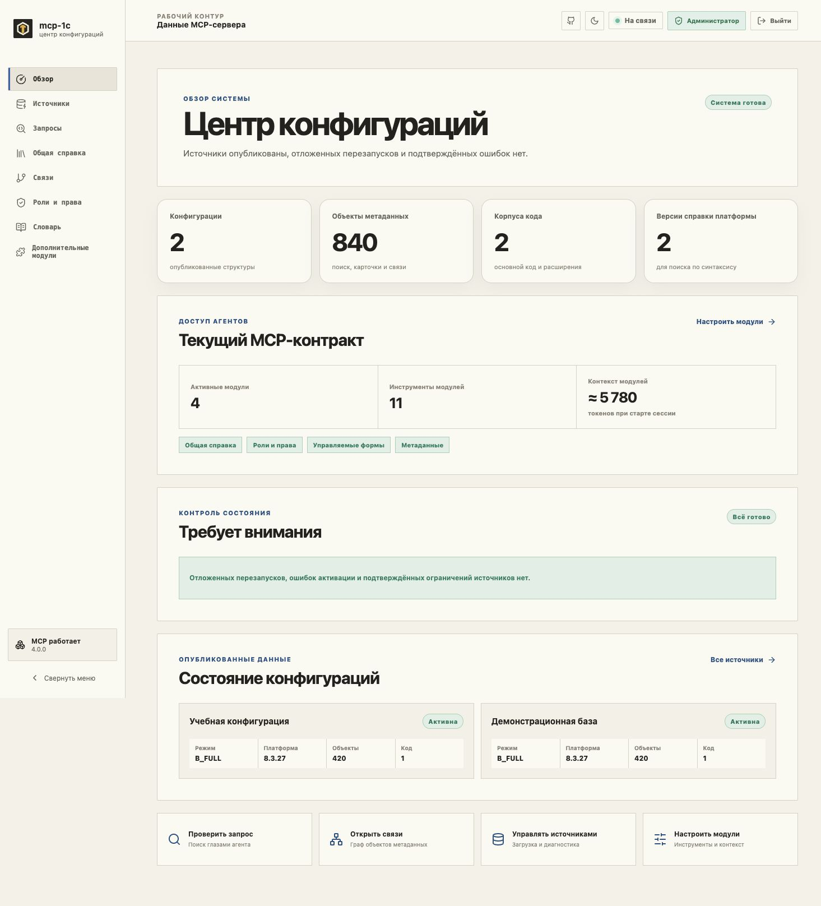

# MCP-сервер для разработки на 1С

`mcp-1c` помогает AI-агенту писать BSL с опорой на вашу конфигурацию и справку
целевой версии платформы. Он даёт доступ к метаданным, модулям, формам, связям
объектов и ролям. Несколько конфигураций работают в одной установке.

Например, агент может найти справочник по описанию, прочитать процедуру,
найти её вызовы или проверить сигнатуру метода для нужной версии 1С.
Сервер запускается готовым Docker-образом; всё состояние
конкретной установки находится в каталоге `data/`.

<picture>
  <source media="(prefers-color-scheme: dark)" srcset=".github/assets/dashboard-overview-dark.png">
  <source media="(prefers-color-scheme: light)" srcset=".github/assets/dashboard-overview-light.png">
  
</picture>

<p align="center"><sub>Интерфейс дашборда на полностью синтетических данных.</sub></p>

## Возможности

- Поиск объектов и процедур по имени и назначению, чтение кода и поиск вызовов.
- Структура объектов, связи, таблицы запросов и сравнение конфигураций.
- Справка нескольких версий платформы: сигнатуры, доступность и рекомендации.
- Чтение управляемых форм и объявленных прав ролей.
- Дашборд для загрузки источников, просмотра конфигураций и настройки модулей.
- Локальные skills для форматирования BSL, ревью, создания форм и метаданных.

## Быстрый запуск

Нужны **Docker с Compose v2.17+, curl и OpenSSL**. Команды ниже рассчитаны на
терминал Linux/macOS; на Windows используйте WSL. Python, Node и клонирование
репозитория для запуска готового образа не требуются.

### 1. Скачать файлы запуска

Создайте новый каталог установки:

```bash
mkdir mcp-1c
cd mcp-1c
curl --fail --show-error --location --output compose.yaml \
  https://raw.githubusercontent.com/AzeevAN/mcp-1c/v4.2.0/compose.yaml
curl --fail --show-error --location --output .env.example \
  https://raw.githubusercontent.com/AzeevAN/mcp-1c/v4.2.0/.env.example
```

### 2. Создать .env и токены

Следующий блок копирует шаблон в `.env` и записывает два разных случайных токена:

```bash
umask 077
mcp1c_api_token=$(openssl rand -hex 32)
mcp1c_admin_token=$(openssl rand -hex 32)
sed -e "s/^API_TOKEN=$/API_TOKEN=$mcp1c_api_token/" \
    -e "s/^ADMIN_TOKEN=$/ADMIN_TOKEN=$mcp1c_admin_token/" \
    .env.example > .env
unset mcp1c_api_token mcp1c_admin_token
```

Сохраните `.env`: `API_TOKEN` нужен агенту для чтения, `ADMIN_TOKEN` — для входа
в дашборд и изменения источников. При обновлении установки сохраняйте свои
токены; этот блок предназначен для первого запуска.

### 3. Создать каталог данных

**Linux с обычным Docker:**

```bash
sudo install -d -o 10001 -g 10001 -m 0750 ./data
```

**macOS или Windows с Docker Desktop:**

```bash
mkdir -p data
```

Rootless Docker, user namespace и особенности прав каталогов описаны в
[полной инструкции установки](docs/installation.md#3-подготовить-каталог-данных-на-linux).

### 4. Запустить и открыть

```bash
docker compose config --quiet
docker compose up -d --wait --wait-timeout 180
curl --fail http://127.0.0.1:5001/health
```

Откройте **[http://127.0.0.1:5001](http://127.0.0.1:5001)** в браузере и войдите
с `ADMIN_TOKEN` из `.env`. MCP endpoint: `http://127.0.0.1:5001/mcp`.
При первом запуске Docker скачивает образ; команда `--wait` ждёт готовности
контейнера до 180 секунд. Если запуск завершился ошибкой, см.
[диагностику](docs/installation.md#12-диагностика-запуска).

По умолчанию сервер доступен только на вашей машине. Для подключения с другой
машины, HTTPS, изменения порта, установки без Docker и диагностики используйте
[руководство установки](docs/installation.md).

## Загрузить данные

Сервер может запуститься без конфигураций. Откройте страницу **«Источники»**
в дашборде и добавьте нужные данные:

1. **Конфигурацию:** ZIP структуры из обработки экспортера (Source A) или
   полную файловую выгрузку из Конфигуратора (Source B).
2. **Справку платформы:** `shcntx_ru.hbk` из установленной версии 1С.
3. **Расширения:** отдельную файловую выгрузку с выбранной конфигурацией-родителем.

Source A даёт структуру объектов; Source B дополнительно содержит код, формы
и роли. Подключение Source B требует предварительной проверки и подтверждения
публикации. Индексы и загруженные данные сохраняются в `data/`.

Подробный порядок, форматы ZIP, ограничения и API:
[загрузка конфигураций и расширений](docs/configuration-loading.md).
Обработка для выгрузки структуры: [exporter-1c/README.md](exporter-1c/README.md).

## Подключить агента

Сервер использует **Streamable HTTP**. Передайте агенту `API_TOKEN` из `.env`.
Для Codex CLI добавьте в `~/.codex/config.toml`:

```toml
[mcp_servers.mcp1c]
url = "http://127.0.0.1:5001/mcp"
env_http_headers = { "X-Api-Token" = "MCP1C_API_TOKEN" }
```

В терминале установки прочитайте токен в переменную окружения и запустите Codex:

```bash
export MCP1C_API_TOKEN="$(sed -n 's/^API_TOKEN=//p' .env)"
codex
```

Не используйте административный токен в конфигурации агента.
Копируемые настройки остальных клиентов и локального `stdio`:

| Клиент | Инструкция |
|---|---|
| Claude Code | [HTTP и .mcp.json](docs/clients.md#claude-code) |
| Codex CLI | [config.toml](docs/clients.md#codex-cli) |
| Cursor | [mcp.json](docs/clients.md#cursor) |
| VS Code Copilot | [mcp.json](docs/clients.md#vs-code-с-copilot) |
| Qwen Code | [httpUrl](docs/clients.md#qwen-code) |
| Локальный процесс | [stdio](docs/clients.md#локальный-stdio) |

### Как работает MCP

Клиент выполняет `initialize` → `tools/list` → `tools/call`. Описания и схемы
инструментов остаются в контексте агента всю сессию; данные конфигурации
приходят только по запросу. Обычно агент сначала вызывает `list_configurations`,
выбирает конфигурацию и затем ищет объект или процедуру. Пропуск выбора может
привести к ошибке `config`; сервер предлагает повторить `list_configurations`.

После включения дополнительных модулей и перезапуска откройте новую
MCP-сессию, чтобы клиент получил актуальный список инструментов. SSE не
поддерживается. Подробности протокола и диагностики — в [clients.md](docs/clients.md).

## Инструменты и дополнительные модули

| Инструмент | Назначение |
|---|---|
| `list_configurations` | выбрать конфигурацию и увидеть доступные источники |
| `list_extensions` | фактическая активность расширений из отдельного снимка сеанса |
| `search_objects` | человеческая формулировка → точное имя объекта |
| `search_procedures` | имя или назначение → точный адрес процедуры |
| `get_procedure` | оглавление модуля или ограниченное тело процедуры |
| `get_module_source_file` | условно: ссылка и короткоживущий билет на gzip-файл полного исходника одного модуля |
| `get_callers` | места вызовов, подписки, задания, HTTP-методы и события форм |
| `get_object` | поля, их доказанное происхождение, постраничные HTTP-endpoint и подсистемы с продолжением по `cursor`, XDTO-пакеты и типы, таблицы запроса, связи и кодовые сведения объекта |
| `get_related` | непосредственные входящие и исходящие связи |
| `compare_configurations` | различия имён реквизитов одного объекта в выбранной паре конфигураций, постранично |
| `search_syntax` | поиск по синтаксису и таблицам запросов платформы |
| `get_syntax` | сигнатура, доступность, версия, пример и замена; `full` добавляет первые 50 ссылок на связанные карточки, `links` продолжает список через `links_offset`; одноимённые варианты с одинаковым адресом возвращаются вместе |
| `search_reference` | условно: короткие карточки из доверенной общей справки |
| `get_reference` | условно: точная карточка или раздел с продолжением по курсору |
| `find_roles_for_access` | условно: роли-кандидаты по объекту и точным базовым либо интерактивным операциям из объявленных прав |
| `get_role_access` | условно: компактные объекты роли, явная дочерняя/аудитная детализация и окна RLS |

Параметры, порядок вызовов, пагинация и ограничения каждого инструмента:
[полное описание MCP-инструментов](docs/tools.md).

Постоянное read-only ядро дополняется подключаемыми capability-модулями. На экране **«Дополнительные модули»** можно
включить общую справку, инструменты ролей и скачивание полного модуля.
Сохраните выбор и перезапустите сервер; отключённые модули не публикуют свои
инструменты в MCP. Для скачивания исходника задайте `MCP1C_PUBLIC_BASE_URL`
с адресом сервера, доступным агенту. Без него ссылка не выдаётся.

Ролевые инструменты показывают объявленные права; фактический доступ
пользователя по совокупности ролей и значений RLS они не вычисляют.

Настройки, API и измеренная стоимость контекста модулей:
[руководство эксплуатации](docs/operations.md#внутренние-capability-модули).

## Skills

Skills устанавливаются в клиентский агент отдельно от MCP-сервера:

| Skill | Назначение |
|---|---|
| [bslfmt](skills/bslfmt/SKILL.md) | Форматирование файла или полного метода BSL с сохранением комментариев. |
| [bsl-change-review](skills/bsl-change-review/SKILL.md) | Визуальное ревью или инструкция ручного внесения изменений. |
| [1c-form-creator](skills/1c-form-creator/SKILL.md) | Создание, изменение и проверка управляемых форм. |
| [1c-metadata-creator](skills/1c-metadata-creator/SKILL.md) | Сборка объекта метаданных с формой или без неё. |

Формы и метаданные создаются локальными скриптами, исходники остаются на клиенте.
Эти операции не публикуются как MCP-инструменты.
Для этих скриптов нужен Python 3.12+. Сборка проверяет структуру файлов;
конкретный BSL-код компилируется и проверяется в целевой версии 1С.
Установка, обновление и команды — в [каталоге skills](skills/README.md).

## Источники данных

| Источник | Откуда берётся | Что будет без него |
|---|---|---|
| Структура конфигурации | обработка из `exporter-1c/` | нет объектов, реквизитов и графа |
| Код конфигурации | выгрузка конфигурации в файлы | нет процедур основной реализации и базы для доказательства происхождения |
| Слой расширения | отдельная файловая выгрузка расширения с явно выбранным родителем | нет собственных объектов, кода, форм, ролей и проверяемых borrowed overlays этого расширения |
| Активность расширений | `СнимокРасширений_*.json` из отдельной обработки | активность и порядок ответа платформы остаются `unknown` |
| Справка платформы | `shcntx_ru.hbk` установленной 1С | нет методов, свойств и событий платформы |
| Общая справка | отдельная каноническая SQLite schema v1 | нет `search_reference` и `get_reference`; остальные инструменты работают |
| Объявленные права ролей | role snapshot полной файловой выгрузки | нет `find_roles_for_access`, `get_role_access` и данных страницы `/roles`; структура и код работают |
| Локальный словарь | `data/dictionary.json` | нет терминологии конкретной установки |

Конфигурации и справки платформы загружаются из ваших файлов; в репозитории их
нет. Необязательная общая справка поставляется подписанным read-only артефактом.
Подробное происхождение данных: [data-sources.md](docs/data-sources.md).

## CLI и установка без Docker

CLI помогает управлять источниками, словарём, общей справкой и замерами поиска:
`python -m mcp1c.cli`, `python -m mcp1c.server`, `python -m mcp1c.bench`.
Полные списки команд, флагов и воспроизводимые примеры:
[руководство эксплуатации](docs/operations.md).
Установка без Docker и `stdio`: [installation.md](docs/installation.md#запуск-без-docker).

## Данные и доступ

`data/` хранит состояние установки и монтируется отдельно от образа. Сохраняйте
этот каталог при обновлениях. Обязательные разные токены разделяют чтение и
администрирование; `.env` и реальные данные не публикуются в Git.
Прямой HTTP передаёт токены без шифрования — для внешнего доступа используйте
HTTPS по [инструкции](docs/installation.md#9-удалённый-сервер-через-https).

## Документация

| Задача | Руководство |
|---|---|
| Подробная установка, обновление, права и диагностика | [installation.md](docs/installation.md) |
| Загрузка конфигураций, расширений и справки | [configuration-loading.md](docs/configuration-loading.md) |
| Подключение MCP-клиентов | [clients.md](docs/clients.md) |
| Все инструменты и сценарии вызовов | [tools.md](docs/tools.md) |
| CLI, настройки и обслуживание | [operations.md](docs/operations.md) |
| Источники и схема выгрузки | [data-sources.md](docs/data-sources.md), [schema-v1.md](docs/schema-v1.md) |
| Дашборд | [dashboard/README.md](dashboard/README.md) |
| Архитектура и разработка | [architecture.md](docs/architecture.md), [CONTRIBUTING.md](CONTRIBUTING.md) |
| Контракты дашборда и обработки кода | [dashboard-design.md](docs/dashboard-design.md), [modules-intake-design.md](docs/modules-intake-design.md), [modules-provider-design.md](docs/modules-provider-design.md) |
| Типовые события процедур | [standard-procedure-intents.md](docs/standard-procedure-intents.md) |
| История изменений и безопасность | [CHANGELOG.md](CHANGELOG.md), [SECURITY.md](SECURITY.md) |

Переход с предыдущих версий: [обновление установки](docs/installation.md#переход-на-новую-версию).

## Помочь проекту реальным примером

Если ответ сервера неверен или неполон, создайте
[issue](https://github.com/AzeevAN/mcp-1c/issues/new): укажите, какую задачу вы решали,
что ожидали получить и что получили. Перед публикацией обезличьте пример.
Не прикладывайте содержимое каталога `data/`, реальные имена и токены.
Полный формат примера описан в [CONTRIBUTING.md](CONTRIBUTING.md).

## Лицензия

Apache-2.0: [LICENSE](LICENSE) и [NOTICE](NOTICE). Проект не связан с ООО «1С».
В репозиторий не входят выгрузки конкретных внедрений и исходные справки 1С.
